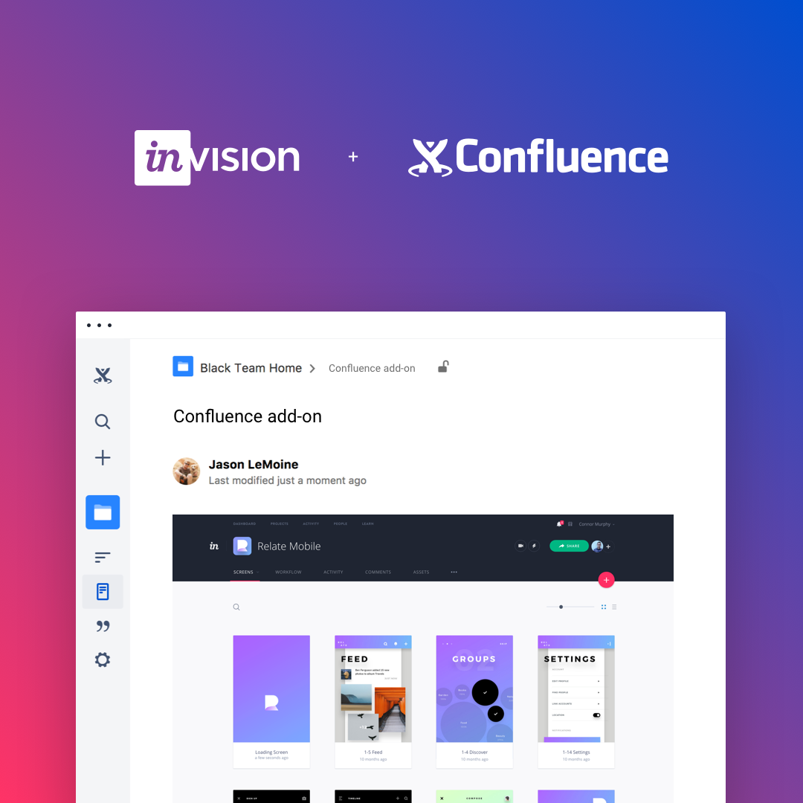

**[InVision](https://www.invisionapp.com/)** is the world's leading design collaboration platform helping teams of all sizes deliver better digital experiences, faster, together. Millions of customers use InVision to brainstorm, prototype, review, iterate, and test web and mobile designs. InVision is used by over 75% of the Fortune 100 and enables product design at leading companies like Airbnb, Shopify, Salesforce, Disney, Netflix, IBM, Walmart, Apple, and more.

The add-on is a [React](https://facebook.github.io/react/) application built on top of the [Confluence Cloud API](https://developer.atlassian.com/cloud/confluence/about-confluence-cloud-rest-api/) using [Create React App](https://github.com/facebookincubator/create-react-app).

* Preview InVision prototypes in Confluence pages
* Quick access to prototypes

## Development

1. Clone repository `git clone git@github.com:InVisionApp/integration-confluence-addon.git`
2. Install dependencies `yarn install --pure-lockfile`
3. Run webpack development server `npm start`
4. Proxy requests to local environment `ngrok http 3000` (you will need to have [ngrok](https://ngrok.com/) installed)

## Configuration

The application provides the following environment variables for configuration:
* `REACT_APP_CUSTOM_HEAD` - whatever needs to be injected into *HEAD* of the application
* `REACT_APP_CUSTOM_FOOTER` - whatever needs to be injected before the closing *BODY* tag
* `REACT_APP_BASE_URL` - Base URL where application is being hosted
* `REACT_APP_API_URL` - API URL

All the above variables need to be configured in a `.env` file which should be included in the repository. To configure the environment variables, please follow the [Create React App documentation](https://github.com/facebookincubator/create-react-app/blob/master/packages/react-scripts/template/README.md#adding-custom-environment-variables)

## Testing

`npm test`

## Usage

After launching ngrok, enter the URL for the connect file (e.g., https://[Your ngrok ID].ngrok.io/atlassian-connect.json) into the "Upload add-on" prompt on the Manage add-ons page (e.g., https://[your subdomain].atlassian.net/wiki/plugins/servlet/upm). The new InVisionApp for Confluence add-on should show up in your list of User-installed add-ons.
